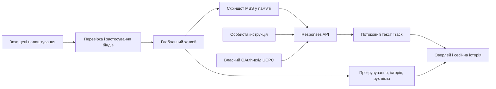

# Архітектура UCPC 0.2

## Локальна програма

Один процес Windows на Python / PySide6. Глобальні клавіші реєструються через RegisterHotKey, без клавіатурних хуків. Qt керує треєм, напівпрозорим оверлеєм із білою або чорною темою та власним редактором налаштувань. Мережеві запити працюють у фоновому asyncio-потоці. Звукового модуля немає.

## Вхід та модель

OAuth-реєстрація й токени належать UCPC. PKCE, state і nonce прив’язані до конкретної спроби; ID-токен перевіряється за підписом, issuer, audience, expiry та nonce. Токени захищені Windows DPAPI у профілі поточного користувача. FileLock серіалізує оновлення refresh token. Повторна кнопка входу відкриває ту саму вкладку; скасування та номери спроб відкидають застарілі події. Неповний HTTP-запит до локального callback має окремий короткий таймаут.

Збережена модель користувача — gpt-5.6-sol. Перед запитом перевіряється доступність slug у каталозі акаунта; каталог також доступний у власному вікні налаштувань. Модель не має інструментів, доступу до файлів або виконання команд: їй передаються інструкція і скріншот. Окремий API-режим залишається доступним через конфігурацію.

## Потоковий текст і навігація

Track синхронізує текст між мережею та Qt через RLock і обмежує відповідь 40 000 символів. Термі­нальна відповідь ігнорує пізні мережеві дані. Engine скасовує попередній запит перед новим. Незавершені й порожні потоки не вважаються успіхом; частковий текст залишається доступним.

History містить до 20 відповідей за замовчуванням. Для кожної зберігається вертикальна й горизонтальна позиція читання. Нові фрагменти тексту не змінюють виділення й позицію прокручування. Історія живе лише в оперативній пам’яті.

Розмір тексту та параметри керування записуються в config.toml. Геометрія вікна — у ui.json у профілі Windows. При зміні конфігурації з нового запиту використовується незмінний знімок Config; поточний запит продовжує свою роботу.

## Налаштування і клавіші

Вкладки: клавіші, вигляд, акаунт, інструкція. У вигляді залишено лише вибір білої/чорної теми; геометрія редагується перетягуванням вікна та QSizeGrip. Застосування теми зберігає поточну геометрію. Усі елементи доступні через Tab, Shift+Tab, Enter та Space. Ctrl+1…4 перемикають вкладки, Ctrl+S застосовує, Esc приховує. Під час запису комбінації глобальні клавіші тимчасово знімаються, щоб не виконувати стару дію.

Дублікати перевіряються до застосування. Зайнята комбінація повертає попередній комплект клавіш. Запис конфігурації атомарний; помилка збереження також відновлює бінди й попередню інструкцію. Нові ID реєстрацій дозволяють ігнорувати повідомлення WM_HOTKEY від знятих біндів. Зайнятий бінд при запуску відкриває редактор замість завершення програми.

Старі поля голосу й старі стандартні бінди автоматично мігрують. Власні комбінації для дій, що залишилися, зберігаються. Модель та особиста інструкція не замінюються стандартними шаблонами.

Типові комбінації використовують Ctrl+Win без Alt, щоб не викликати підказки меню редактора. Вони перевірені проти 1261 правила з повного Windows-списку Microsoft, числових правил установленого VS Code 1.140.0 та 92 правил його вбудованих розширень. Усі 19 стандартних біндів мають три клавіші. Власні налаштування редактора й сторонні розширення можуть змінювати цей результат.

## Виключення із захоплення

Windows SetWindowDisplayAffinity з WDA_EXCLUDEFROMCAPTURE застосовується окремо до оверлею, налаштувань і меню в треї. GetWindowDisplayAffinity підтверджує результат до показу вікна. Якщо захист не підтверджено, вікно з текстом залишається прихованим. Перед власним скріншотом видимі вікна також приховуються, DwmFlush синхронізує композитор, після захоплення вікна відновлюються.

Напівпрозоре біле або чорне тло малюється у верхньому Qt-вікні; тема змінює також колір тексту, кнопок, виділення і фокуса. Перемикання стилю не змінює HWND та виключення із захоплення. Клавіші й інструкція редагуються всередині захищеного вікна, без зовнішнього редактора. Вибір моделей — вбудований список без окремого popup. Звичайний браузер входу/лімітів не виключається із захоплення UCPC. Результат у конкретній сцені OBS перевіряється тестовим записом.

## Перенесення на інший Windows 11 x64

PyInstaller збирає UCPC.exe і залежності у папку `_internal`. Python на цільовому ПК не потрібний. Створення ZIP виконується після погодження користувача.

Збірка використовує список дозволених модулів та файлів-шаблонів. Лого logo/logo.png включене явно, використовується в треї та як іконка EXE; аудит дозволяє лише цей конкретний PNG та перевіряє його вміст. Робочі .env, config.toml, system_prompt.txt, data та профіль входу не копіюються. Аудит відхиляє відомі імена особистих/робочих файлів і створює маніфест з відносними шляхами та SHA-256. Для тесту EXE копіюється в окрему папку; LOCALAPPDATA процесу направляється в тимчасовий чистий профіль. Власний вхід користувача не переноситься й не скидається.

## Межі

Поки немає автозапуску, постійної історії або інтерактивного вибору області захоплення. Область можна задати в config.toml. Архів призначений для Windows 11 x64. Відповіді залежать від зображення, інструкції, доступу до моделі й мережі.
